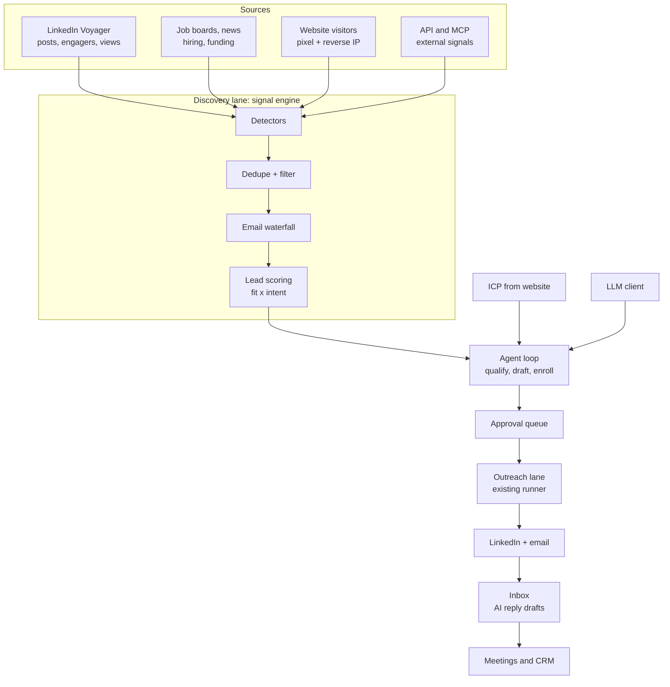

# Linki → AI Signal-Based SDR: PRD

Oct 7, 2026 · Source doc: https://claude.ai/code/artifact/1afb2760-10d9-49db-b4cd-7c54d63a39ec

## Summary

We will turn Linki from a manual outreach tool into an autonomous, signal-based AI SDR at Gojiberry's level: the user enters a website, an AI agent learns the ICP, finds buyers showing intent, scores them, and contacts them over LinkedIn and email. About 70% of the plumbing (sequencing, inbox, CRM, API, MCP, deliverability) already exists; the work is a signal engine, an agent loop and an AI layer on top.

**Problem.** Today a user must find leads themselves (Sales Nav list or CSV), build a campaign by hand and start it. The `signals` table exists but nothing detects signals, so leads are cold and setup takes hours.

**Goals**

1. Signup to a running agent in under 10 minutes, with no manual list building.
2. Every lead in the feed carries a reason: the signal, an ICP-fit verdict and a score.
3. Outreach copy references the lead's signal, with a copilot mode that requires approval before sending.
4. Agents run 24/7 inside LinkedIn safety budgets, with no extra risk to sending accounts.
5. Stay open-source and self-hostable: every paid data provider is optional and pluggable.

**Non-goals (this PRD)**

- Building our own B2B contact database; we use providers and LinkedIn.
- A hosted multi-tenant SaaS with billing; workspaces exist, billing stays out of scope.
- Channels beyond LinkedIn and email (X/Twitter, WhatsApp, phone dialer).
- Rewriting the stack (Next.js Pages Router + SQLite stay).

## Current state of the repo

Linki is a single-process Next.js 16 app on SQLite with a Playwright LinkedIn runner; it has strong execution plumbing but no lead discovery or agent layer.

| Area | What exists | Key files |
| --- | --- | --- |
| Web app | Next.js 16 Pages Router, React 19, Tailwind 4 + DaisyUI, next-auth | `pages/`, `components/layout/Sidebar.tsx` |
| Database | SQLite (better-sqlite3), hand-rolled migrations, ~60 tables, workspace-scoped | `lib/db.ts` (1,517 lines) |
| Background work | One sequential runner loop with watchdog timeouts, started at boot | `lib/linkedin/runner.ts` (1,738 lines), `instrumentation.ts`, `lib/watchdog.ts` |
| LinkedIn | Playwright + stealth; Voyager and Sales Nav APIs called in-page; visit, connect, message, InMail, accepted-sync, inbox sync | `lib/linkedin/*` |
| Lead sourcing | Sales Nav list import, CSV import, batched daily caps | `lib/linkedin/scraper.ts`, `lib/csv-import.ts`, `lib/import-jobs.ts` |
| Enrichment | Apollo match, Sales Nav profile enrich, live profile scrape incl. last 10 posts with reaction counts, email verification | `lib/apollo.ts`, `lib/linkedin/profile-scrape.ts`, `lib/email/verify.ts` |
| Campaigns | Multichannel steps, delays, A/B templates, conditional branches, per-lead tracks | `lib/outreach/*`, `lib/platform/conditions.ts` |
| Email | SMTP/IMAP, OAuth mailboxes, durable send jobs, tracking, warmup, SPF/DKIM/DMARC | `lib/email/*`, `lib/platform/deliverability.ts` |
| AI | OpenRouter via fetch: message writer, reply classifier + auto follow-up | `lib/community-ai.ts`, `lib/community-replies.ts` |
| Signals | Storage + rules only: `ingestSignal()` bumps `intent_score` and can auto-enroll; 6 fixed types; no detectors | `lib/platform/signals.ts` |
| Platform | Workspaces + RBAC, audit, suppression/DNC, HubSpot/Salesforce, calendars, opportunities, `/api/v1`, webhooks, MCP + OAuth | `lib/platform/*`, `lib/mcp/*`, `pages/api/v1` |
| UI | Overview, Inbox, Tasks, Lists, People, Companies, Campaigns, Deliverability, Platform; a documented design system | `pages/*`, `Linki Design System/` |
| Tests | Vitest, ~30 unit tests on platform logic | `tests/` |

**What we build on:** the runner loop, `ingestSignal()` + `signal_rules`, the Voyager in-page request pattern in `profile-scrape.ts`, the OpenRouter client, the inbox classifier, `worker_leases`/`email_jobs`, and the MCP server.

**Debt to clear first:** `pages/workflows/[id].tsx` (4,113 lines), `pages/settings.tsx` (2,029) and `pages/contacts/[id].tsx` (1,556) break the 500-line rule and will absorb new features badly; the runner does everything in one loop, so new scraping work would starve outreach.

## Users and journeys

The primary user is a founder or solo SDR who runs their own outbound and wants warm leads without building lists.

| Persona | Context | Needs most |
| --- | --- | --- |
| Founder-seller | B2B SaaS or agency, 1–10 people, no SDR team | Fast setup, warm leads, booked demos |
| SDR / AE | Runs outbound for a team, owns 1–3 LinkedIn seats | Volume within safe limits, reply handling, CRM sync |
| Sales lead / admin | Team of 3+, multiple agents and senders | Agent per segment, approvals, analytics per signal |
| Self-hosting builder | Technical user, runs Linki on own server | Pluggable providers, API/MCP, no lock-in |

**Core journeys**

1. **Onboard:** enter website URL → AI drafts ICP, personas, competitors, keywords → user edits and confirms → connects LinkedIn and email → picks signals → launches agent.
2. **Daily review:** open Leads feed → see new leads ranked by score, each with "why this lead" → approve, skip or edit the drafted first message (copilot) or let autopilot send.
3. **Reply:** reply lands in Inbox → AI classifies and drafts an answer, offering meeting slots for positive replies → user sends or edits.
4. **Tune:** Analytics shows meetings per signal type and per agent → user turns off weak signals, adjusts ICP or copy.
5. **Integrate:** leads, signals and meetings sync to HubSpot/Salesforce; external tools push signals in via API or MCP.

## Feature requirements

Ten features, F1–F10; P0 = must ship for the agent to work, P1 = needed for parity, P2 = differentiation.

| ID | Feature | Priority | Phase |
| --- | --- | --- | --- |
| F1 | ICP from website | P0 | 1 |
| F2 | Agents | P0 | 1–3 |
| F3 | Signal engine (detectors) | P0 | 2 |
| F4 | Lead scoring (fit × intent) | P0 | 1–2 |
| F5 | Leads feed + "why this lead" | P0 | 2 |
| F6 | Signal-aware AI copy + copilot approvals | P0 | 3 |
| F7 | Email waterfall enrichment | P1 | 4 |
| F8 | Lookalike lead finding | P1 | 4 |
| F9 | AI reply drafts + meeting booking | P1 | 5 |
| F10 | Signal and agent analytics | P2 | 5 |

### F1. ICP from website

- User enters a URL; the server fetches the homepage plus up to 10 linked pages (pricing, about, product, customers), strips them to text and sends them to the LLM.
- The LLM returns a structured ICP: one-line offer, value props, pain points, target industries, company size ranges, geographies, buyer personas (titles, seniority, departments), competitors (names + LinkedIn page URLs), keywords and hashtags, exclusions, and suggested Sales Nav filters.
- The user can edit every field before saving; the ICP is versioned so the agent's past decisions stay explainable.
- Acceptance: for 8 of 10 test websites, the generated personas and competitors need no more than 3 edits.

### F2. Agents

- An agent bundles: ICP, enabled signal sources and their settings, a target campaign (workflow), sender accounts (LinkedIn + email), daily budgets, mode (copilot or autopilot), schedule and minimum score to contact.
- Each agent runs a loop: discover → dedupe → enrich → score → qualify → draft → approve or auto-enroll → sequence.
- Agents can be paused, cloned and run side by side (one per segment); each has a status page with today's counts and its last errors.
- Acceptance: an agent with 2 signal sources runs 7 days unattended, stays inside every budget, and adds at least 1 qualified lead per day on a test workspace.

### F3. Signal engine

Each detector is a scheduled job that emits leads and signals through `ingestSignal()`. The `signals.type` check constraint is widened to the types below.

| Signal type | How we detect it | Data source | Default weight |
| --- | --- | --- | --- |
| `competitor_engagement` | Reactors and commenters on recent posts of tracked competitor company pages and their execs | LinkedIn Voyager (in-page, like `profile-scrape.ts`) | 30 |
| `influencer_engagement` | Reactors and commenters on posts of tracked creators in the space | LinkedIn Voyager | 20 |
| `keyword_engagement` | Authors and engagers of recent posts matching ICP keywords | LinkedIn content search | 25 |
| `own_content_engagement` | People engaging with the user's own and company posts | LinkedIn Voyager | 35 |
| `profile_view` | People who viewed the user's profile | LinkedIn (Premium accounts only) | 30 |
| `company_follow` | New followers of the user's company page | LinkedIn (page admins only) | 25 |
| `job_change` | Re-check known contacts; current company or title differs from stored | Sales Nav / Voyager re-scrape | 25 |
| `hiring` | Open roles at tracked or ICP companies matching relevant titles | Greenhouse, Lever, Ashby public job APIs | 20 |
| `funding` | New rounds at ICP companies | News RSS + LLM extraction; Crunchbase optional | 25 |
| `website_visit` | Visitor identified on the user's site | Tracking pixel + reverse-IP provider (optional, paid) | 40 |
| `custom` / `api` | Pushed by external tools | `/api/v1/signals`, MCP | set by caller |

- Every signal stores: source URL (post or job link), a snippet (the comment text or post excerpt), occurred_at and the detector run id.
- Dedupe: one lead per LinkedIn member URN; repeat signals stack on the same lead, not new leads.
- Engagers who fail basic ICP filters (title, geography, exclusions) are dropped before enrichment, to save budget.
- Acceptance: the competitor-engagement detector turns 1 tracked page with 10 recent posts into leads with correct names, profile URLs and signal snippets for at least 95% of the engagers LinkedIn returns.

### F4. Lead scoring

- **Fit score (0–100):** the LLM judges contact + company against the ICP and returns the score, a verdict (strong, possible, poor), and a one-line reason. Rule-based pre-filters run first to save tokens.
- **Intent score (0–100):** the sum of signal weights × recency decay (half-life 14 days by default), capped at 100. This replaces today's flat `intent_score` bump.
- **Lead score** = 0.6 × fit + 0.4 × intent; the weights can be set per agent. The agent contacts only leads above its threshold.
- Missing headline or about text must not block scoring: fall back to title, company and signal context and mark the result "low confidence".
- Acceptance: on a hand-labelled set of 100 leads, strong-fit precision is 80% or higher.

### F5. Leads feed

- A new page listing leads by score, filterable by agent, signal type, fit verdict, status and date.
- Each row shows a "why this lead" card: signal chips with snippet and link, the fit reason, score breakdown, and the drafted first message.
- Actions: approve, edit and approve, skip (with reason, used to tune scoring), add to list, open contact.

### F6. Signal-aware copy and copilot

- The AI writer prompt receives the strongest signal (type, snippet, source) plus the ICP's value props, so the opener references a real event ("saw your comment on X's post about Y").
- Hard rule kept from `community-ai.ts`: only facts present in the context; never invent.
- **Copilot mode:** every first touch (connect note, first message or email) waits in an approval queue. **Autopilot:** sends after a configurable delay unless the user rejects it.
- Acceptance: in a blind review, 90% of 50 drafts reference the signal correctly with no invented facts.

### F7. Email waterfall enrichment

- Providers run in an order the user sets, stopping at the first verified hit: Apollo (exists), Hunter, Prospeo, Dropcontact, Findymail, then pattern guessing + SMTP verify (exists in `lib/email/verify.ts`).
- Each provider is a plugin with a key, a per-day cap and a cost per lookup; results are cached per person.
- Acceptance: on the test set, verified-email coverage is 15 points higher than Apollo alone.

### F8. Lookalike leads

- From the ICP plus the leads who replied or booked, the agent generates Sales Nav search URLs and imports matches through the existing scraper.
- Lookalikes are tagged `lookalike` (low intent); they fill daily capacity when signals run dry.

### F9. AI reply drafts and meetings

- For each classified reply, draft a response in the inbox; positive replies include 3 open slots from the connected calendar or the user's booking link.
- Drafts are never sent without approval in copilot mode; in autopilot, only positive and out-of-office replies are handled automatically.
- Booked meetings attach to the contact, signal and agent so attribution works (the `meetings` table exists).

### F10. Analytics

- A funnel per agent and per signal type: detected → qualified → contacted → accepted → replied → positive → meeting.
- Cost per meeting, from LLM tokens + provider lookups.
- Weekly digest email per workspace.

## Technical design

We keep the stack and add four bounded contexts — `icp`, `signals`, `agents`, `ai` — plus a job queue with separate lanes, so discovery work never blocks outreach.



Existing in Linki: LinkedIn access, API/MCP, outreach runner, sends, inbox, meetings/CRM. New: discovery lane, ICP, LLM client, agent loop, approval queue.

### Module layout

| Path | Responsibility |
| --- | --- |
| `lib/ai/client.ts` | Typed OpenRouter wrapper: zod-validated JSON output, retries, token and cost logging to `ai_usage` |
| `lib/ai/prompts/*` | Versioned prompts: icp-extract, fit-score, first-touch, reply-draft |
| `lib/icp/` | Website fetch + text extraction, ICP generation, ICP versions |
| `lib/signals/sources/*.ts` | One file per detector, each implementing `SignalSource` |
| `lib/signals/scoring.ts` | Intent decay, fit × intent, thresholds |
| `lib/signals/dedupe.ts` | Member-URN and email identity resolution into `targets` |
| `lib/agents/loop.ts` | Agent state machine: discover → enrich → score → draft → approve → enroll |
| `lib/enrichment/providers/*.ts` | Waterfall provider plugins (Apollo moves here) |
| `lib/jobs/queue.ts` | Durable job queue on SQLite, built on `worker_leases` |
| `lib/linkedin/budget.ts` | Per-account daily request and action budgets shared by scraping and outreach |

```ts
interface SignalSource {
  type: SignalType;
  requires: Array<"linkedin_session" | "premium" | "page_admin" | "provider_key">;
  // Returns raw candidates; the framework dedupes, filters, scores and ingests.
  run(ctx: SourceContext, config: unknown): Promise<SignalCandidate[]>;
  costPerRun(config: unknown): { linkedinRequests: number; providerCalls: number };
}
```

### Data model changes

| Table | Change | Key columns |
| --- | --- | --- |
| `icps` | new | workspace_id, version, website_url, offer, personas_json, industries_json, sizes_json, geos_json, competitors_json, keywords_json, exclusions_json, sales_nav_filters_json |
| `agents` | new | workspace_id, name, icp_id, workflow_id, mode (copilot/autopilot), min_score, fit_weight, status, schedule_json, budgets_json |
| `agent_sources` | new | agent_id, source_type, config_json (tracked pages, keywords…), enabled, last_run_at, cursor_json |
| `agent_senders` | new | agent_id, account_id or email_account_id |
| `tracked_entities` | new | workspace_id, kind (company_page/creator/keyword), linkedin_url, label |
| `signals` | alter | widen `type` check; add agent_id, source_url, snippet, weight, detector_run_id |
| `targets` | alter | add fit_score, fit_verdict, fit_reason, fit_confidence, lead_score, scored_at, source (signal/lookalike/import) |
| `approval_queue` | new | agent_id, target_id, step_id, channel, draft_subject, draft_body, status, decided_by, decided_at |
| `jobs` | new | lane, type, payload_json, run_at, attempts, status, lease_until, last_error |
| `detector_runs` | new | agent_source_id, started_at, finished_at, candidates, ingested, linkedin_requests, error |
| `enrichment_cache` | new | identity_key, provider, result_json, verified, fetched_at |
| `ai_usage` | new | workspace_id, purpose, model, input_tokens, output_tokens, cost_usd |

Migrations follow the existing pattern in `lib/db.ts`, but move into `lib/db/migrations/NNN_*.ts` so `db.ts` stops growing.

### Job queue and lanes

- Replace the "do everything per tick" runner with a lease-based queue (`jobs` table) and three lanes, each with its own concurrency of 1 per LinkedIn account: **outreach** (existing steps, highest priority), **discovery** (detectors, enrichment), **sync** (inbox, accepted, CRM, webhooks).
- The existing runner becomes the outreach lane's worker, with no change to step logic; inbox and CRM syncs move to the sync lane.
- One browser context per LinkedIn account is shared across lanes through a mutex, so the fingerprint and session stay single.
- Every job is idempotent and wrapped in the existing `withTimeout` watchdog.

### LinkedIn safety budgets

- Each account gets daily budgets: profile views, Voyager reads, searches, connects, messages. Defaults: 150 reads, 30 searches, plus today's connect and message limits.
- Discovery may use at most 40% of the read budget; outreach always has priority.
- Requests are paced with jitter (8–20 s) and only run inside the account's active hours.
- On 429, a challenge or a logout, the account is paused for 24 h and the user is alerted.
- Optional dedicated "scout" accounts: LinkedIn accounts marked discovery-only, so sending accounts are never used for scraping.
- Provider fallback: a `LinkedInDataProvider` interface lets Unipile, Apify or Bright Data replace in-browser scraping per detector.

### LLM layer

- All calls go through `lib/ai/client.ts` with a zod schema per prompt. Invalid JSON is retried once, then the item is marked failed.
- Models are set per purpose: a cheap model for fit scoring at volume, a stronger one for ICP extraction and copy. They stay user-selectable via the existing model picker.
- Fit scoring is batched (10 leads per call) and cached by ICP version + target hash.
- Prompt-injection guard: scraped post or comment text is passed as quoted data, never as instructions.

### APIs and MCP

- REST: `/api/icp`, `/api/agents/*`, `/api/leads` (feed), `/api/approvals/*`, `/api/tracked-entities`.
- `/api/v1`: add `agents`, `icps` and `approvals` read endpoints; `signals` POST already exists.
- MCP tools: `create_agent`, `list_leads`, `approve_draft`, `add_tracked_entity`, so Claude can operate agents end to end.
- Domain events: `lead.discovered`, `lead.qualified`, `draft.pending`, `draft.approved`, `meeting.booked`, all through the existing webhook pipeline.

## UI and UX

The product moves from list-first to agent-first: Agents and Leads become the top of the sidebar, and the existing pages stay as the execution layer. All new screens use the Linki Design System tokens and components.

**Sidebar after the change:** Overview · **Agents** · **Leads** · **Approvals** · Inbox · Tasks · People · Companies · Lists · Campaigns · Deliverability · Platform.

| Screen | Purpose | Main elements |
| --- | --- | --- |
| Onboarding wizard (`/onboarding`) | Signup to running agent in under 10 min | 1 Website URL → 2 Review ICP (editable cards) → 3 Pick signals + tracked competitors/creators → 4 Connect LinkedIn + email → 5 Choose copilot/autopilot + daily volume → Launch |
| Agents (`/agents`) | See and control all agents | Card per agent: status, today's discovered/qualified/contacted, budget bars, pause/clone |
| Agent detail (`/agents/[id]`) | Configure one agent | Tabs: Overview (funnel), ICP, Signals (sources + tracked entities + last runs), Sequence (links to campaign), Senders, Settings |
| Leads feed (`/leads`) | Daily triage of warm leads | Score-sorted list; "why this lead" side panel with signal chips, snippet, fit reason, score bar, drafted message; approve / edit / skip |
| Approvals (`/approvals`) | Copilot queue | Draft per row with contact context; bulk approve; keyboard shortcuts (A, E, S) |
| Inbox (existing) | Replies | Add AI draft above the composer, "insert meeting slots" button |
| Contact detail (existing) | Full history | Add a Signals timeline and score breakdown; split the 1,556-line page into components first |
| Analytics (Overview) | What works | Funnel per agent and per signal type, cost per meeting |

**UX rules**

- Every AI output is explained (reason text) and editable before it acts.
- Empty states show what the agent is doing ("Scanning 3 competitor pages, next run 14:20") rather than a blank table.
- Limits and pauses are explicit: a banner when an account budget or a LinkedIn challenge stops work.
- Mobile: the Leads feed and Approvals work at phone width, so a user can triage from their phone.

## Roadmap

Six phases (0–5) over about 16 weeks, assuming 2 engineers; each phase ends at a gate that must pass before the next starts.

1. **Phase 0: Foundation (weeks 1–2).** Split `workflows/[id].tsx`, `settings.tsx` and `contacts/[id].tsx` into components under 500 lines. Move migrations to `lib/db/migrations`. Build `lib/ai/client.ts` with zod output and `ai_usage`. Build the `jobs` queue and lanes, with the runner moved onto the outreach lane unchanged.
   - Gate: existing test suite green; a 3-day soak shows outreach throughput unchanged versus main.
2. **Phase 1: ICP + agents + fit score (weeks 3–5).** F1 ICP from website, `icps`/`agents` tables, onboarding wizard steps 1–2, fit scoring on existing contacts, score shown on People.
   - Gate: ICP acceptance (8/10 sites, 3 edits or fewer); fit precision of 80% or higher on 100 labelled leads.
3. **Phase 2: Signal engine MVP (weeks 6–9).** `SignalSource` framework, LinkedIn budgets, detectors for competitor engagement, influencer engagement, own-content engagement and job change; tracked entities; Leads feed with "why this lead".
   - Gate: 95% engager accuracy; zero account restrictions across 3 test accounts over 14 days.
4. **Phase 3: Autonomous agent + copilot (weeks 10–12).** Agent loop, signal-aware copy, approval queue, autopilot delay, full onboarding wizard, Agents pages.
   - Gate: an agent runs 7 days unattended inside its budgets; 90% of drafts pass the blind review.
5. **Phase 4: Data coverage (weeks 13–14).** Email waterfall providers, keyword engagement, hiring and funding detectors, lookalikes, optional website-visitor source.
   - Gate: email coverage +15 points over Apollo alone.
6. **Phase 5: Close the loop (weeks 15–16).** AI reply drafts, meeting slots and attribution, per-signal analytics, weekly digest, new API + MCP tools.
   - Gate: one end-to-end path verified, from signal to booked meeting, attributed in analytics and synced to CRM.

**Build order inside every phase:** schema + migration → lib module with unit tests (London-school mocks for LinkedIn and the LLM) → API route → UI → MCP/API exposure → docs in README.

## Metrics, risks and open questions

Success is measured by meetings booked per agent per week, with LinkedIn account safety as a hard constraint.

| Metric | Target |
| --- | --- |
| Signup → agent running | under 10 min median |
| Qualified leads per agent per day | 10 or more |
| Connection acceptance on signal leads | 1.5× cold-list baseline |
| Positive reply rate | 2× cold-list baseline |
| Meetings per agent per week | 3 or more |
| Account restrictions | 0 per 1,000 account-days |
| AI + data cost per meeting | tracked; target set after Phase 3 |

| Risk | Impact | Mitigation |
| --- | --- | --- |
| LinkedIn restricts accounts from scraping volume | Sending accounts lost | Budgets, discovery capped at 40% of reads, scout accounts, pluggable data providers |
| LinkedIn changes Voyager endpoints | Detectors break silently | Detector health checks; `detector_runs` alerting on 0 results; fixtures from real responses in tests |
| Missing headline/about lowers ICP accuracy | Good leads scored low | Low-confidence fallback scoring; re-score after profile scrape |
| LLM cost at volume | Expensive self-hosting | Rule pre-filters, batching, cache, cheap model for scoring |
| SQLite write contention with more workers | Slow UI, lock errors | WAL already on; short transactions; one writer per lane; Postgres adapter as a later option |
| Prompt injection via scraped posts | Wrong or harmful copy | Scraped text passed as quoted data; output schema; copilot default |
| GDPR / ToS exposure | Legal risk for users | Clear docs; opt-out + suppression already present; data retention setting for signals |

**Open questions**

- [ ] Use Unipile (or Apify/Bright Data) for discovery from day one, or start in-browser and add providers later?
- [ ] Default mode for new agents: copilot (safer) or autopilot (closer to Gojiberry)?
- [ ] Which reverse-IP provider for website visitors, and is it in scope for the open-source build?
- [ ] Is a hosted version with billing planned? It changes how provider keys and credits work.
- [ ] When headline and about are missing, should we spend a profile scrape to get them before scoring?
